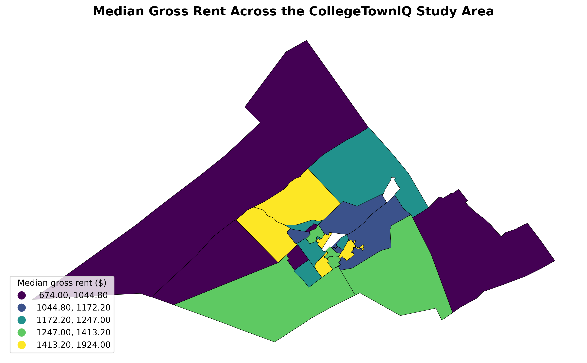
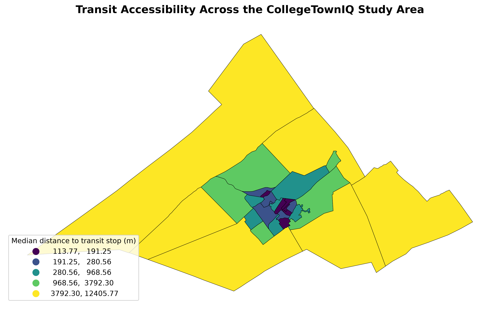

# CollegeTownIQ

### Geospatial Data Science for Housing Affordability, Accessibility, and Mobility Tradeoffs

CollegeTownIQ is a geospatial data science platform that investigates how housing affordability and accessibility interact within a college town.



*Median gross rent across the State College study area. Source: 2024 ACS 5-Year estimates.*



*Median pedestrian-network distance to the nearest CATA transit stop across the study area.*

The project uses **State College, Pennsylvania** as a detailed case study and combines public housing, socioeconomic, transportation, food-access, and geographic data to quantify location-level tradeoffs.

Instead of producing a single "best neighborhood" score, CollegeTownIQ keeps affordability and accessibility as separate dimensions so users can examine the tradeoffs themselves.

---

## Why I Built This

As a college student in State College, I became interested in a practical question:

> How much does the location of housing change the overall accessibility and mobility burden faced by students?

Rent alone does not describe the practical cost of a location.

Two areas with similar housing costs can differ substantially in their access to public transportation, essential services, and other resources.

CollegeTownIQ was built to quantify those differences using reproducible data engineering, geospatial analysis, and statistical methods.

---

## Research Questions

The project focuses on four questions:

1. **How does housing cost vary geographically within a college town?**
2. **How does access to transportation and essential services vary geographically?**
3. **Is housing cost associated with accessibility after accounting for observable area-level characteristics?**
4. **How do affordability and accessibility tradeoffs change under different location constraints?**

The analysis is intentionally observational. The project does not claim that accessibility causes housing prices to change.

---

## Study Area

The initial case study covers five municipalities in the State College region:

- State College Borough
- College Township
- Ferguson Township
- Harris Township
- Patton Township

The study area contains **28 census tracts** used in the geospatial analysis.

The primary regression analysis uses **25 complete tract-level observations**.

---

# Data Sources

CollegeTownIQ integrates multiple public datasets.

| Source | Data Used | Purpose |
|---|---|---|
| U.S. Census Bureau ACS 2024 5-Year | Rent, income, vehicle availability, rent burden | Housing and socioeconomic analysis |
| CATA GTFS | Transit stops, trips, schedules | Transit accessibility |
| USDA Food Access Research Atlas / SRAM | Food-access measures | Essential-service accessibility |
| Census TIGER/Line | Census tract boundaries | Geographic analysis |
| Centre County GIS | Municipal boundaries | Study-area definition |
| OpenStreetMap | Pedestrian street network | Network accessibility |

All source datasets are kept separate from the reproducible processing pipeline.

---

# Technical Architecture

```text
                 PUBLIC DATA SOURCES
                        │
        ┌───────────────┼────────────────┐
        │               │                │
      Census           CATA             USDA
        │               │                │
        └───────────────┼────────────────┘
                        ▼
                 DATA INGESTION
                        │
                        ▼
                DATA CLEANING
                        │
                        ▼
              GEOSPATIAL PROCESSING
                        │
             ┌──────────┴──────────┐
             │                     │
       Census Tracts          Transit Network
             │                     │
             └──────────┬──────────┘
                        ▼
             ACCESSIBILITY METRICS
                        │
                        ▼
               STATISTICAL ANALYSIS
                        │
          ┌─────────────┼─────────────┐
          │             │             │
         EDA        Regression    Sensitivity
          │             │             │
          └─────────────┼─────────────┘
                        ▼
              GEOSPATIAL VISUALIZATION
                        │
                        ▼
              INTERACTIVE DASHBOARD